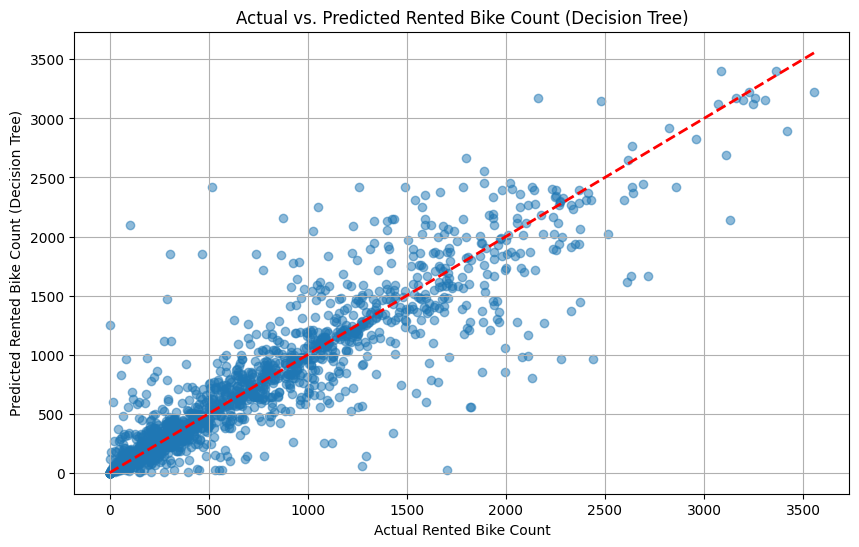

# bike-sharing-prediction

## problem statement
Urban bike-sharing systems face significant operational challenges in balancing bike availability and station capacity throughout the day. Demand fluctuates based on time of day, weather, season, and other factors, making it difficult to ensure that bikes are available where and when users need them. Without accurate predictions of daily rental demand, operators struggle with inefficient resource allocation, increased operational costs, and reduced customer satisfaction.

## objective
- Predict daily bike rental demand (regression) to improve resource planning and optimize fleet distribution

## data source
https://www.kaggle.com/datasets/joebeachcapital/seoul-bike-sharing

## key features
- Exploratory Data Analysis (EDA): Conducted comprehensive analysis of the dataset, exploring its structure, data types, and statistical summaries. Identified key features and patterns that impact bike demand, such as time, temperature, and weather conditions.

-Data Cleaning and Preprocessing: Cleaned the dataset by handling duplicate values, missing data, and outliers. Ensured the integrity and quality of the data for accurate modeling.

-Feature Engineering: Engineered relevant features and transformed variables to capture meaningful information for prediction. Performed feature encoding, handled multicollinearity, and applied transformations to improve model performance.

-Model Training and Evaluation: Trained and evaluated various regression models using a scaled feature set.i used linear regression and cesicion tree models

-Performance Metrics: Evaluated the models using industry-standard metrics such as R-squared, and mean squared error (MSE)

## Model Performance

The scatter plot below shows how well the model's predictions match the actual bike rental counts on the test set.

- Each dot represents a day's rental count.
- The red dashed line is the ideal line where prediction = actual.
- A tighter clustering around this line indicates better model accuracy.

## Results and Conclusion
Through this project, I successfully developed a regression model to predict bike demand in metropolitan areas. The model achieved high accuracy and reliability in forecasting the number of bikes required at different time intervals.

The analysis revealed significant insights into the factors influencing bike demand, such as peak rental hours, temperature, seasonality, weather conditions, and humidity. These findings can assist in resource planning, optimizing bike allocation, and improving user experience in bike-sharing programs.

